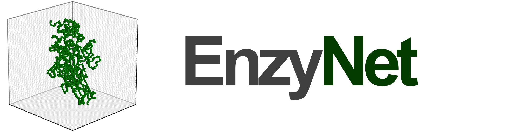
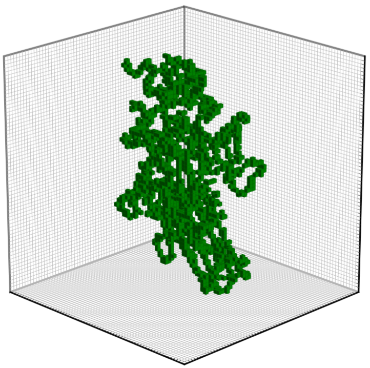
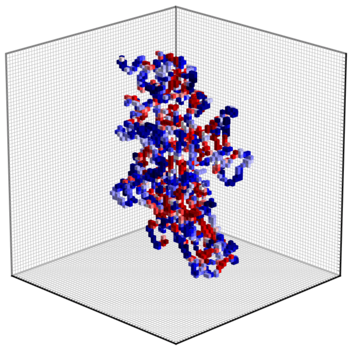
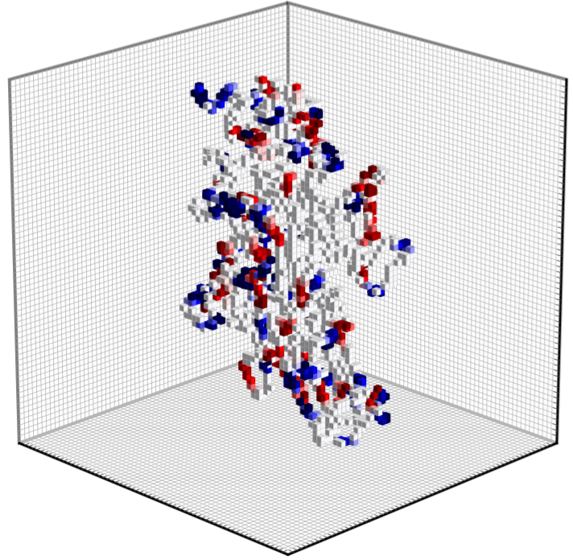

<div align="center">

</div>

-----------------

**EnzyNet** is a project that uses **3D convolutional neural networks** for **enzyme classification**. This repository contains all of the code that has been used to design, test, and run [EnzyNet](https://arxiv.org/pdf/1707.06017.pdf "Project's paper"). We tried to make it as user-friendly as possible, so that you can run tests on your own datasets too! If you are interested in the background of this project, you can take a look at [our previous publications](https://stanford.edu/~shervine#publications "Publications").

## Installation
### Compatibility
This code has been designed to work correctly with Python 3 on all platforms.

### Procedure
To enjoy the features of this package, you will first have to download the project and go to the root of the folder.
```
cd /path/to/enzynet/
```
Then, just type
```
pip3 install -r requirements.txt
```
to install the dependencies.

Once this is done, we advise you to install the package in editable mode, so that you can modify the code as you wish and play with it right away. To do so, just type
```
pip3 install -e .
```
This is it, you are now ready to use EnzyNet!

## Usage
### Training
In order to train one of the 3D convolutional networks described in the paper, go to `scripts/architecture/` and open the adequate Python file. Now, be sure to select
```python
mode_run = 'train'
```
before running the script with the command
```
python3 enzynet_[weights-mode].py
```
where `[weights-mode]` corresponds to either `uniform` or `adapted`.

### Testing
For testing phase, go to the same Python script as for training. This time, select
```python
mode_run = 'test'
```
After you enter
```
python3 enzynet_[weights-mode].py
```
in the terminal, Python will load the weights that had been previously computed and stored in `scripts/architecture/checkpoints/` in order to perform the predictions on the testing set.

## Data visualization
In this package, we also developed a tool aimed at visualizing the PDB files in the representation that we adopted in the paper.

||||
|:-------:|:----------:|:------:|
| Binary  | Hydropathy | Charge |

For example, if you wish to see how the binary representation of enzyme `2Q3Z` looks like in a cube of edge size 32, simply go to `enzynet/visualization.py` and fill out the script accordingly. In this case, it will be
```python
if __name__ == '__main__':
    visualize_pdb('2Q3Z', vsize = 32, weights = None)
```

Then, just type
```
python3 visualization.py
```
in the terminal console to automatically compute and save the result in a PDF file to the folder `scripts/volume/`.

## Customization
### Dataset
If you want to do your experiments on another dataset, you have to make sure that it has the same structure as in `datasets/partition_single.csv` . If you don't, that's not a big deal! Just have a list of your PDB IDs in `.txt` files, like those in `datasets/make_files/raw/`. Then, you can perform the conversion by running the proper segments of the code in `datasets/make_files/generate_datasets.py`.

### Architecture
Thanks to the user-friendliness of the high-level deep learning framework used in this project, you can also let your imagination run wild and very easily come up with your own architecture. To do so, you can go to `scripts/architecture/` and directly modify the existing Python files accordingly.

## Reference
You can find our paper on [arXiv](https://arxiv.org/pdf/1707.06017.pdf "Paper"). The associated BibTeX code is
```
@article{Amidi2017,
  author = {A. Amidi and S. Amidi and D. Vlachakis and V. Megalooikonomou and N. Paragios and E. Zacharaki},
  title = {EnzyNet: enzyme classification using 3D convolutional neural networks on spatial representation},
  journal = {ArXiv e-prints},
  archivePrefix = {arXiv},
  eprint = {1707.06017}
}
```

## Acknowledgements
This project relies on the great deep learning framework [Keras](https://keras.io "Homepage of Keras") coupled with Google's open-source [TensorFlow](https://www.tensorflow.org "Homepage of TensorFlow"), as well as on the very well documented PDB parser [BioPython](http://biopython.org "Homepage of BioPython").
